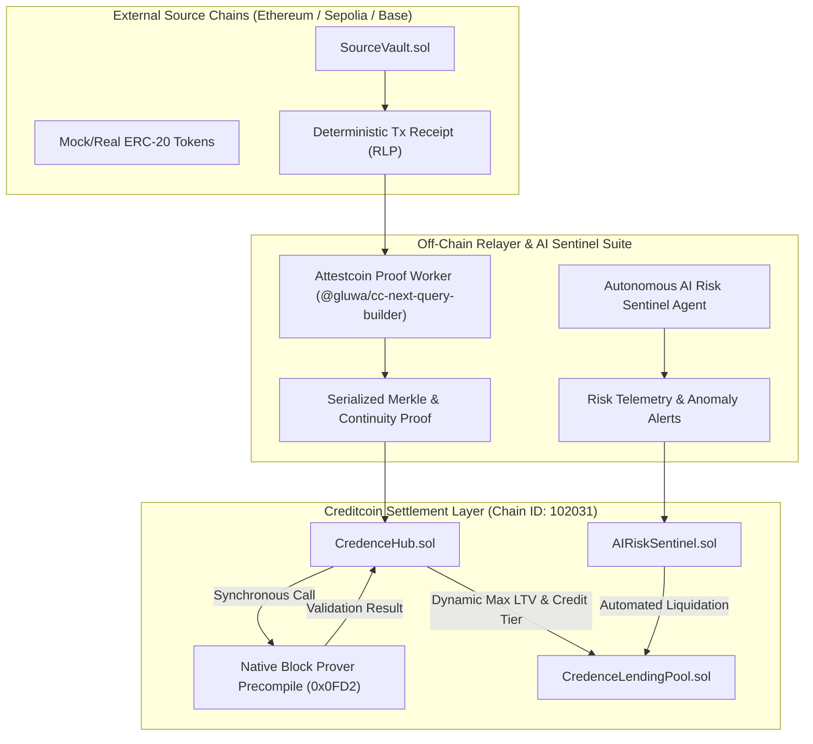

# Credence Technical Architecture

---

## Technical Components & Interfaces

### 1. Creditcoin Precompiles
- **Block Prover (`0x0000000000000000000000000000000000000FD2`):** Validates Merkle Patricia Trie receipts and block continuity.
- **ChainInfo (`0x0000000000000000000000000000000000000FD3`):** Queries validator attestation status for external source chains.

### 2. Core Smart Contracts
| Contract | Chain | Function |
| :--- | :--- | :--- |
| `SourceVault.sol` | Sepolia (`11155111`) | Emits deterministic event receipts for repayments and invoices |
| `xCredenceHub.sol` | Creditcoin (`102031`) | Verifies proofs via `0x0FD2`, computes credit score (xCS), manages tiers |
| `xCredenceLendingPool.sol` | Creditcoin (`102031`) | Multi-asset lending vault, handles undercollateralized loans |
| `AIRiskSentinel.sol` | Creditcoin (`102031`) | Coordinates autonomous risk alerts and proof-backed liquidations |
| `MockBlockProver.sol` | Local / Hardhat | Local emulator for precompile `0x0FD2` |

### 3. Off-Chain Relayer Daemon
- Written in TypeScript using `@gluwa/cc-next-query-builder` (Attestcoin SDK).
- Extracts event logs, generates Merkle inclusion proofs, and broadcasts to Creditcoin testnet.
